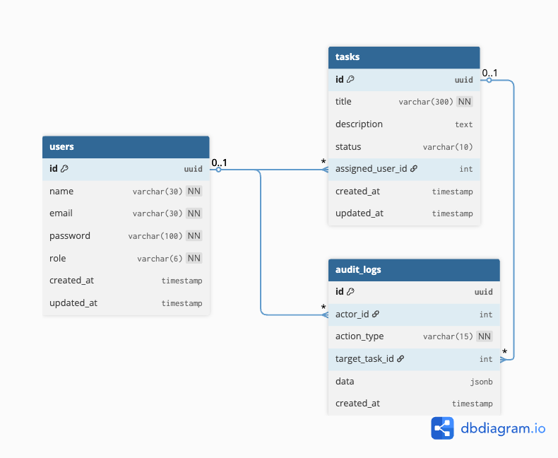

# Taskify — Task Management System App

A production-ready full-stack task management system with role-based access control and audit logging.

## Features

### Authentication

- JWT-based login (no registration — predefined users)
- Token stored in Cookies, injected via Axios interceptor
- Protected routes with role-based redirects

### Admin Capabilities

- Create, update, delete tasks
- Assign tasks to users
- Filter tasks by status, user or search query
- View full audit log of all system actions

### User Capabilities

- View only their assigned tasks
- Update task status (PENDING → PROCESSING → DONE)
- Filter and search their own tasks

### Audit Logging

Every action is recorded:

- `TASK_CREATED` — new task created
- `TASK_UPDATED` — task fields edited
- `TASK_DELETED` — task removed
- `STATUS_CHANGED` — task status updated
- `TASK_ASSIGNED` — task assigned/reassigned

Each log captures: actor, action type, target task, previous data, new data, timestamp.

## Tech Stack

### Backend

- **Node.js** – Runtime environment
- **Express.js** – Web framework
- **TypeScript** – Type-safe development
- **Prisma ORM** – Database ORM
- **PostgreSQL** – Relational database
- **JWT (JSON Web Token)** – Authentication & authorization
- **Zod** – Schema validation

### Frontend

- **React** – UI library
- **TypeScript** – Type safety
- **TanStack Query** – Data fetching & caching
- **Zustand** – Lightweight state management
- **Ant Design** – UI component library
- **React Router DOM** – Client-side routing
- **lucide-react** – Icon library

---

## Database Design (ERD)

## 

---

## Demo Credentials

| Role  | Email             | Password |
| ----- | ----------------- | -------- |
| Admin | admin@taskify.com | admin123 |
| User  | user@taskify.com  | user123  |

## API Reference

### Auth

| Method | Endpoint           | Access | Description                 |
| ------ | ------------------ | ------ | --------------------------- |
| POST   | /api/v1/auth/login | Public | Login with email + password |
| GET    | /api/v1/auth/me    | Auth   | Get current user            |

### Tasks

| Method | Endpoint                 | Access | Description           |
| ------ | ------------------------ | ------ | --------------------- |
| GET    | /api/v1/tasks            | Auth   | List tasks (filtered) |
| GET    | /api/v1/tasks/:id        | Auth   | Get single task       |
| POST   | /api/v1/tasks            | Admin  | Create task           |
| PUT    | /api/v1/tasks/:id        | Admin  | Update task           |
| DELETE | /api/v1/tasks/:id        | Admin  | Delete task           |
| PATCH  | /api/v1/tasks/:id/status | Auth   | Update task status    |

### Users

| Method | Endpoint          | Access | Description    |
| ------ | ----------------- | ------ | -------------- |
| GET    | /api/v1/users     | Admin  | List all users |
| GET    | /api/v1/users/:id | Admin  | Get user by ID |

### Audit Logs

| Method | Endpoint           | Access | Description     |
| ------ | ------------------ | ------ | --------------- |
| GET    | /api/v1/audit-logs | Admin  | List audit logs |

---

## Architecture

Follows Clean Architecture with layered separation:

```
Request → Route → Controller → Service → Model (Prisma)
```

- **Routes** — define endpoints and apply middleware
- **Controllers** — parse/validate input, call service, return response
- **Services** — all business logic, DB operations, audit log creation
- **Middleware** — authentication, authorization, error handling

All API responses follow the format:

```json
{
  "success": true,
  "message": "...",
  "data": {}
}
```
